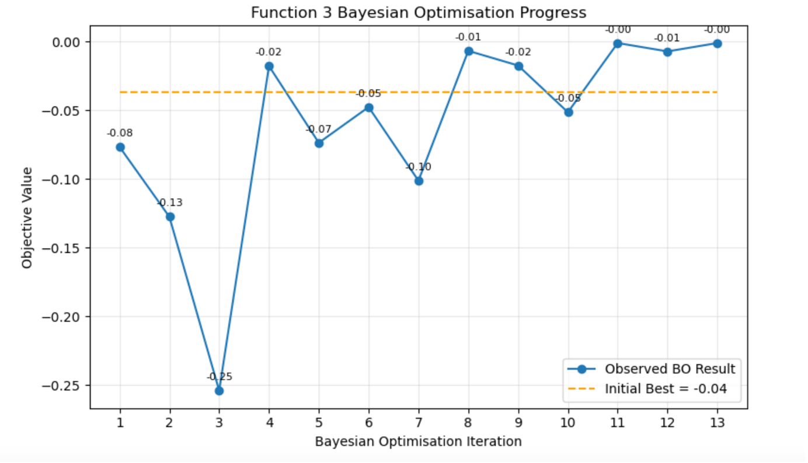
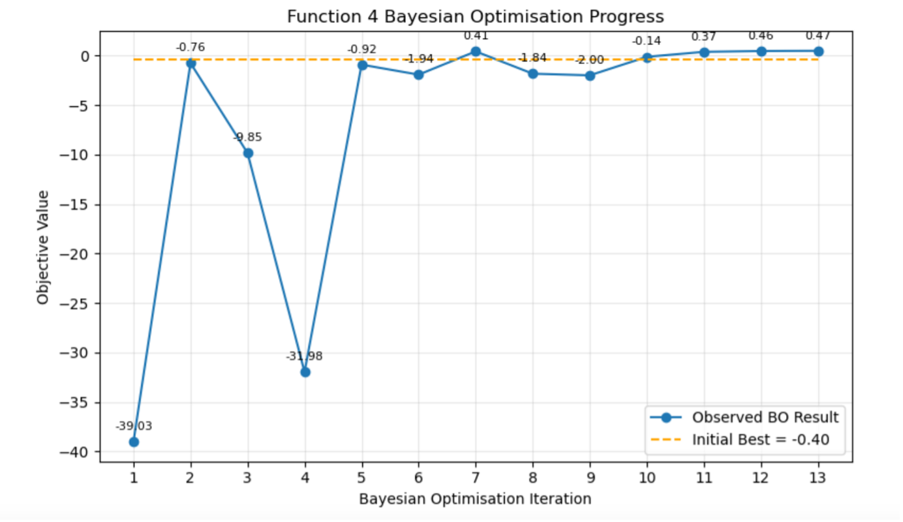
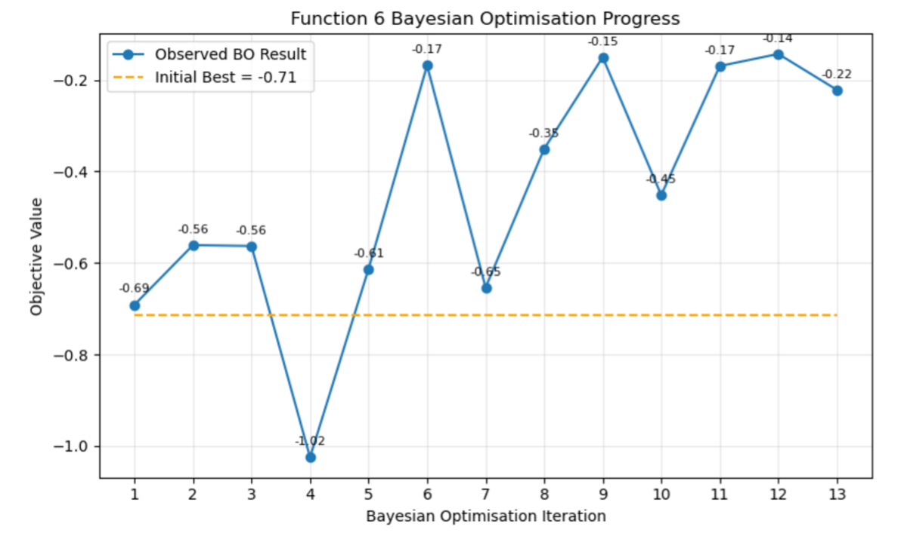
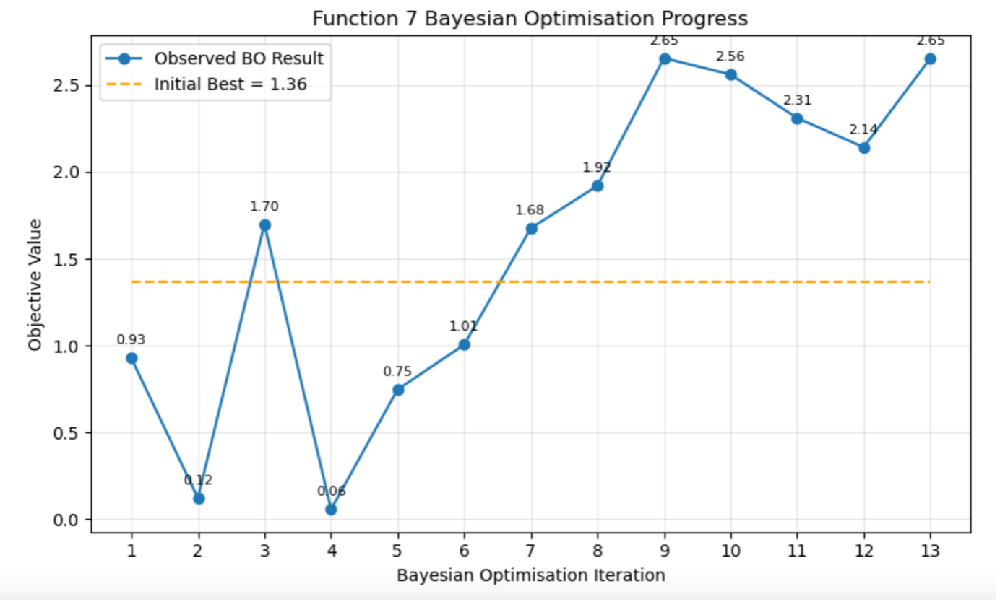
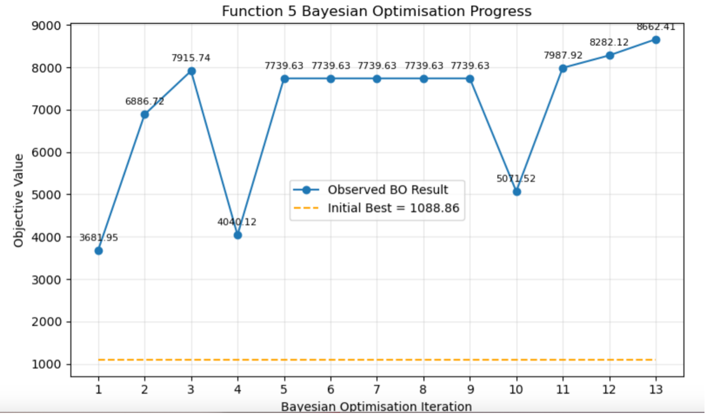
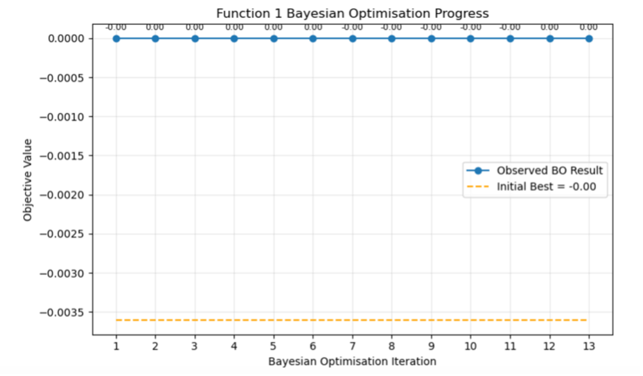
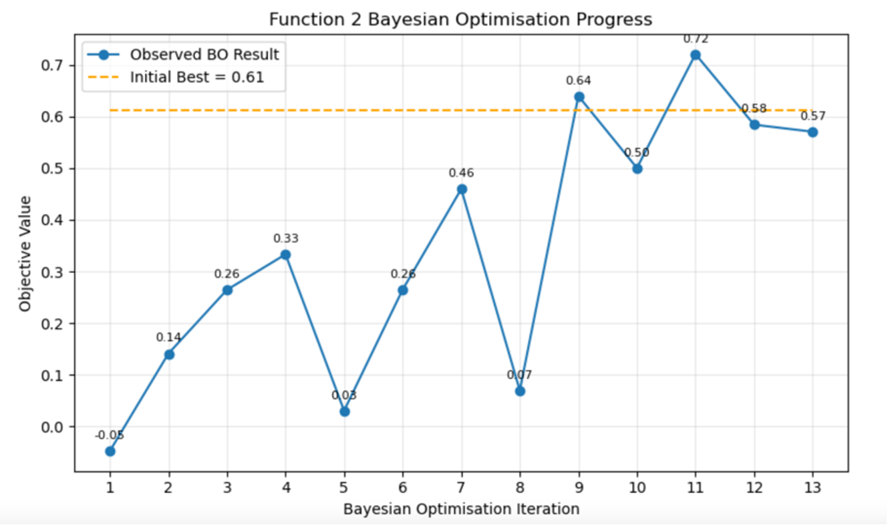

# BAYESIAN OPTIMISATION FOR BLACK BOX FUNCTION OPTIMISATION

## NON-TECHNICAL SUMMARY
This project is a black-box optimisation challenge completed as part of Imperial College London’s Professional Certificate in AI and ML.

There are eight functions and for each I have been provided with a small dataset and context. The core aim is to maximise these eight unknown functions using just thirteen queries. I may use a variety of manual and ML methods to do so. 

The challenge is designed to mirror real world ML work, where models are used to guide decision making under uncertainty and limited evaluation budgets. 

## DATA
The dataset is made up of eight unknown functions with input dimensions ranging from two to eight. All inputs are continuous variables ranging from zero to one and each query returns a singe output value. 

For each function, the dataset contains an initial set of query points and outputs provided as part of the challenge and additional queries which have been added weekly as part of the optimisation process. The number of samples per function ranges from twenty to fifty. 

## MODEL 
Primary optimisation tool used is Bayesian Optimisation, with Gaussian Process surrogate models to approximate each unknown function. This method was chosen because it supports decision-making under uncertainty and limited evaluations well. Acquisition functions were used to select next query points.

The overall strategy progressed from exploration to exploitation throughout the process, with some flexibility based on data outputs. 

Upper Confidence Bound and Expected Improvement acquisitions were applied depending on function characteristics and adapted throughout the optimisation process to balance exploration and exploitation. 

In the latter half of the process, PCA projections were used to identify patterns in the data to support decision making. Similarly, an SVM classifier was applied to one function, 'drawing' an approximate boundary around a well performing region and filtering proposed candidate points. 

Throughout the process, a level of flexibility has been maintained, by incorporating manual, heuristic-based decisions when model outputs were inconsistent with observed patterns. 

## HYPERPARAMETER OPTIMSATION
#Acquisition Function Tuning 
Beta and Xi were tuned to control the exploration and exploitation trade-off. They were manually tuned based on model performance. 

#Surrogate Model Tuning 
Length scale and noise were tuned for the GP surrogate models. GP hyperparameters were optimised automatically by the GP, with manual bounds in place and adjustments made where necessary to avoid overfitting or under-fitting. 

## RESULTS
Across 5/8 functions (3, 4, 6, 7, 8), the optimisation strategy achieved clear improvements over the initial baseline values. 

As demonstrated in the graphs below, results reflect a balanced exploration-exploitation approach with early iterations sampling broadly and later iterations increasingly informed by prior observations to target high-performing regions. 

In the latter stages, results generally stabilised within strong performing regions. While this does not guarantee identification of the global maximum, it provides evidence that robust, high-value regions were effectively located and exploited.
### Function 3

### Function 4

### Function 6

### Function 7

Function 5 demonstrated continued improvement without stabilisation, indicating that further optimisation may have been possible beyond the iteration budget.
### Function 5

There was little optimisation success for function 1 and 2. No clear signal was identified for function one and function 2 demonstrated inconsistent improvements and did not sustain performance above the baseline. These outcomes were influenced by implementation challenges which are documented in week-by-week results for each function provided in the function folders. 
### Function 1

### Function 2

## CONTACT DETAILS
Linkedin: https://www.linkedin.com/in/isobella-cromby-while-b42350225/

